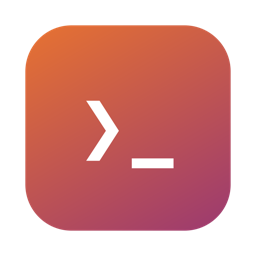
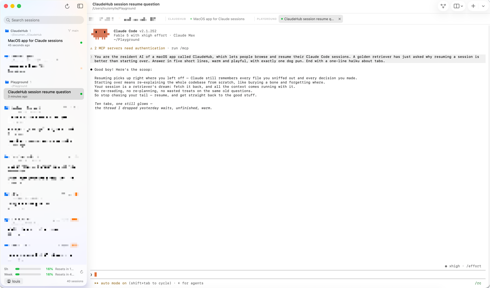

<div align="center">
  

# ClaudeHub

**All your Claude Code sessions. One app.**

Browse every Claude Code session per project in a sidebar — click one and it
resumes in an embedded terminal, in the right folder, instantly.


[](LICENSE)
[](https://github.com/LouisMylle/ClaudeHub/releases/latest)



</div>

## Why

Getting back into a Claude Code session means remembering where it lived,
`cd`-ing there, and digging the right session out of `claude --resume`.
ClaudeHub reads Claude Code's own session store and turns it into a
launcher: every project, every session, one click to pick up where you left
off.

## Features

- 🗂️ **Sessions per project** — grouped by their real working directory, with
  AI-generated titles and last-activity times, sorted by recency
- ⚡ **One-click resume** — opens the session in an embedded terminal
  ([SwiftTerm](https://github.com/migueldeicaza/SwiftTerm)), already in the
  right folder
- 🧵 **Tabs** — every session gets a tab; terminals stay alive when you switch.
  `⌘T` opens a plain shell in the current project's folder
- 🔌 **MCP manager** — see every configured MCP server across user, project
  (`.mcp.json`), and local scopes; add and remove them from the UI (backed by
  the `claude mcp` CLI, so config stays canonical)
- 🙈 **Hide sessions** — declutter the sidebar without deleting anything;
  hidden sessions stay resumable and can be unhidden anytime
- 🌓 **Light & dark** — terminal theme follows the system appearance, live
- 🛟 **Quit protection** — warns you before ⌘Q kills running sessions
- 🔄 **Auto-update** — checks GitHub releases; one click downloads, installs,
  and relaunches
- 🔍 Search across projects and session titles, hand-off to Terminal.app,
  reveal in Finder, copy resume command

## Install

### Download

1. Grab the latest `ClaudeHub-x.y.z.zip` from
   [Releases](https://github.com/LouisMylle/ClaudeHub/releases/latest)
2. Unzip and drag `ClaudeHub.app` into `/Applications`
3. The app is ad-hoc signed (not notarized), so macOS quarantines it on first
   download. Clear it once:

   ```sh
   xattr -dr com.apple.quarantine /Applications/ClaudeHub.app
   ```

You'll need the [Claude Code](https://claude.com/claude-code) CLI installed —
ClaudeHub is a front-end for it.

### Build from source

```sh
git clone https://github.com/LouisMylle/ClaudeHub.git
cd ClaudeHub
./build_app.sh --install   # builds and copies to /Applications
```

Requires the Xcode command line tools. No Xcode project — it's a plain Swift
package.

## Shortcuts

| Keys | Action |
| --- | --- |
| `⇧↩` | Newline in the Claude Code prompt (instead of submitting) |
| `⌘T` | New shell tab in the current folder |
| `⌘W` | Close tab |
| `⇧⌘W` | Close window |
| `⌘1`–`⌘9` | Jump to tab |
| `⌘R` | Rescan sessions |

## How it works

Claude Code stores each session as a JSONL transcript in
`~/.claude/projects/<encoded-path>/<session-uuid>.jsonl`. ClaudeHub scans
those files for the working directory (`cwd`), the AI-generated title
(`aiTitle`), and uses the file's mtime for recency — bridge stubs and
subagent sidechains are filtered out. Selecting a session spawns

```sh
zsh -l -c "cd <cwd> && exec claude --resume <session-id>"
```

inside a SwiftTerm view that stays alive per tab. MCP servers are read from
`~/.claude.json` and per-project `.mcp.json` files; all mutations go through
`claude mcp add` / `claude mcp remove` so ClaudeHub never hand-edits your
config.

## Disclaimer

ClaudeHub is an independent community tool and is not affiliated with,
endorsed by, or sponsored by Anthropic. "Claude" is a trademark of Anthropic,
PBC. The app simply drives the official `claude` CLI on your machine.

## License

[MIT](LICENSE) © 2026 Louis Mylle
